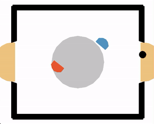

# rl-laser-hockey  

Solves the laser-hockey gym environment [[1]](#1) with Reinforcement Learning (RL) using the Twin Delayed Deep Deterministic policy gradient algorithm (TD3) [[2]](#2). In addition to that, prioritized experience replay (PER) [[3]](#3) and observation normalization [[4]](#4) have been implemented to analyze the effect of these modifications on TD3 in the laser-hockey environment. 

The following figure shows some rollouts of the TD3 agent, playing against the strong basic opponent of the laser-hockey environment:

## How to use

### Requirements:

Minimal requirements are listed in the file `requirements.txt`. Additionally, the laser-hockey environment needs to be installed. This con be done by running: `python -m pip install git+https://github.com/martius-lab/laser-hockey-env.git`. 

### Start training:

To start training, run the file `main.py` as follows: `python main.py --trial <trial_number>`. 

Optionally, there are several command line arguments available to adapt training parameters, set hyperparameters of the TD3 algorithm, or run TD3 with modifications like prioritized experience replay (`--prioritized_replay`) and observation normalization (`--normalize_obs`). A list of all available command line arguments can be found by typing `python main.py --help`. 

### Watch rollouts and compare agents:

The jupyter notebook `rollouts.ipynb` provides code to compare and view rollouts of previously trained agents. Already available agents include the default TD3 agent, trained with tuned hyperparameters and observation normalization (`TD3`), a TD3 agent trained with self-play (`SP-TD3`), and a TD3 agent adapted to other strong RL agents in the laser-hockey environment (`aSP-TD3`). 

### Reproduce Evaluations:

The jupyter notebook `eval.ipynp` shows the most important evaluation results conducted during training of the above agents. It includes the influence of certain hyperparameters, the influence of the modifications prioritized experience replay and observation normalization, and results for self-play.

## Content

-  `models/` : Contains all the model weights and optimizer parameters for the already trained TD3-agents (see above).
-  `results/` : Contains all the data needed to reproduce evaluation.
- `rollouts/`: Some example rollout videos.
-  `eval.ipynb` : Code to reproduce the evaluation of hyperparameters, modifications and self-play. All results can be plotted by rerunning this notebook.
-  `main.py` : Code for training the agents. For instructions how to run, see above.
-  `replay_buffer_test.ipynb` : Some tests to check whether the prioritized replay buffer works correctly.
-  `replay_buffer.py` : Code for the replay buffer and its subclass, the prioritized replay buffer.
-  `rollouts.ipynb` : Notebook to compare and show rollouts of some TD3 agents and the basic opponents of the laser-hockey environment.
-  `sum_tree.py` : Sum tree for the replay buffer.
-  `TD3.py` : Code for the actor, the critic and the training of the TD3 algorithm.
-  `utils.py` : Some utility functions.

## References

<a id="1">[1]</a> G. Martius, and S. Blaes.  A simple laser-hockey gym environment for RL agents. https://github.com/martius-lab/laser-hockey-env, 2021.

<a id="2">[2]</a>  S. Fujimoto, H. Hoof, and D. Meger.   Addressing function approximation error in actor-critic methods.  ICML, 2018.  
  
<a id="3">[3]</a>  T. Schaul, J. Quan, I. Antonoglou, and D. Silver.  Prioritized experience replay.  arXiv preprint arXiv:1511.05952, 2015.

<a id="4">[4]</a>  M. Andrychowicz, A. Raichuk, P. Stanczyk, et al. What matters in on-policy reinforcement learning? A large-scale empirical study. arXiv preprint arXiv:2006.05990. 2020.
